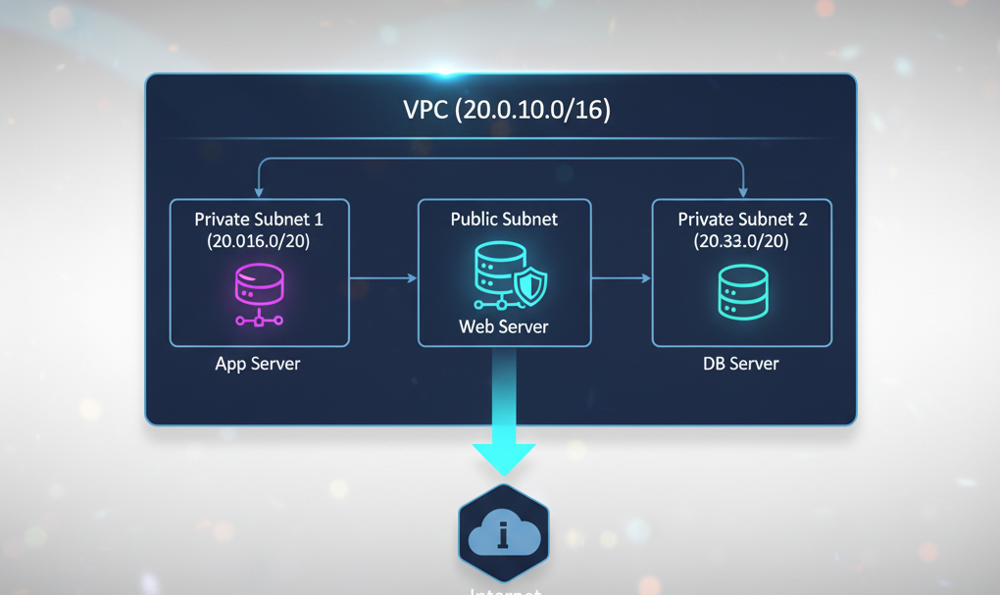
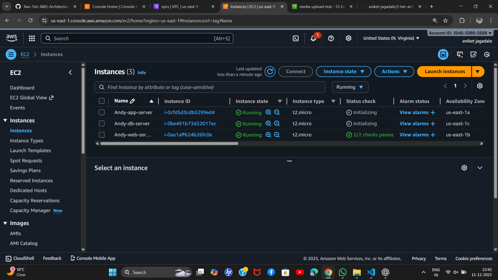
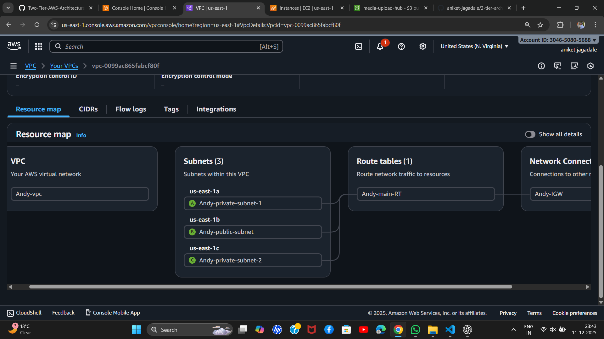

# 3-Tier Architecture Deployment in AWS using Terraform

## 📋 Project Overview
This project implements a secure 3-tier architecture on AWS using Terraform. The architecture consists of web, application, and database tiers deployed across multiple Availability Zones for high availability.

## 🏗️ Architecture Diagram


## 📁 Project Structure

```
├── main.tf              # Main Terraform configuration
├── variables.tf         # Variable definitions
├── outputs.tf           # Output definitions
└── README.md           # This documentation
```

## 🛠️ Infrastructure Components

### **1. Networking**
- **VPC**: `20.0.0.0/16`
- **Subnets**:
  - Private Subnet 1: `20.0.0.0/20` (us-east-1a) - Application Tier
  - Public Subnet: `20.0.16.0/20` (us-east-1b) - Web Tier
  - Private Subnet 2: `20.0.32.0/20` (us-east-1c) - Database Tier
- **Internet Gateway**: For internet connectivity
- **Route Table**: Main route table with internet access
- **Security Group**: Allows SSH (22), HTTP (80), HTTPS (443)

### **2. Compute Resources**

- **Web Server**: Public-facing EC2 instance in public subnet
- **App Server**: Private EC2 instance in private subnet 1
- **DB Server**: Private EC2 instance in private subnet 2

### **3. Security**
- Security group with least-privilege access
- Public instances have internet access
- Private instances isolated from direct internet access
- SSH access restricted to specific IP (0.0.0.0/0 in this demo - modify for production)

## 🔧 Configuration Details

### **Variables (variables.tf)**
```hcl
region = "us-east-1"
project_name = "Andy"
vpc_cidr = "20.0.0.0/16"
# ... and other configurations
```

### **Resources Created (main.tf)**
- AWS VPC with custom CIDR
- Three subnets across different AZs
- Internet Gateway
- Route table with internet route
- Security group with ingress/egress rules
- Three EC2 instances (t2.micro)

### **Outputs (outputs.tf)**
- Public IP of web server
- Private IPs of app and database servers

## 🚀 Deployment Instructions

### **Prerequisites**
1. AWS Account with IAM credentials
2. Terraform installed (v1.0+)
3. AWS CLI configured
4. SSH key pair named "terraformkey" in AWS

### **Steps to Deploy**
```bash
# Initialize Terraform
terraform init

# Plan the infrastructure
terraform plan

# Apply the configuration
terraform apply

# Review outputs
terraform output

# Destroy infrastructure (when done)
terraform destroy
```

## 📊 Expected Output

After successful deployment:
```
Apply complete! Resources: 10 added, 0 changed, 0 destroyed.

Outputs:

public_ip = "54.210.167.177"
private_ip = [
  "20.0.0.50",
  "20.0.32.100",
]
```

## 🖼️ 


- AWS Resource Map with all created components 
- VPC with three subnets across different availability zones
- Route table configuration
- Internet Gateway connectivity
- Resource tagging for easy identification

## 🔐 Security Notes

1. **Production Considerations**:
   - Restrict SSH access to specific IP ranges
   - Use NAT Gateway for private instance updates
   - Implement database security groups
   - Enable VPC Flow Logs

2. **Current Security Group Rules**:
   - Inbound: SSH (22), HTTP (80), HTTPS (443)
   - Outbound: All traffic allowed

## 🧹 Cleanup

To avoid AWS charges, destroy the infrastructure:
```bash
terraform destroy
```

## 📝 Notes

- The architecture follows AWS best practices for 3-tier applications
- Subnets are distributed across multiple AZs for high availability
- Tagging strategy helps with resource management and cost tracking
- Explicit dependencies ensure proper resource creation order

## 📄 License

This project is for educational purposes. Modify as needed for production use.

## 🤝 Contributing

Feel free to submit issues and enhancement requests